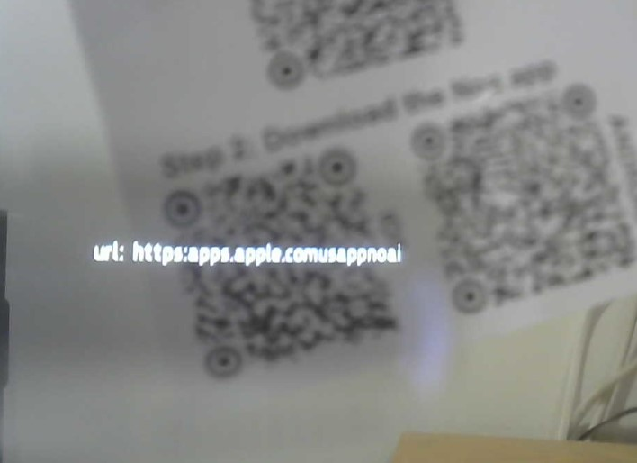
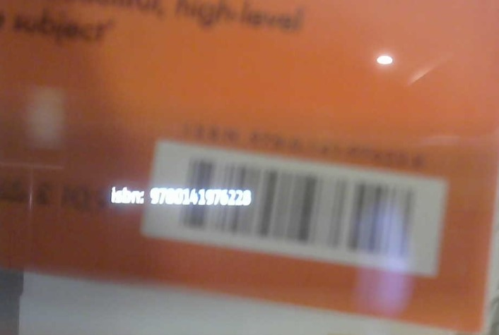
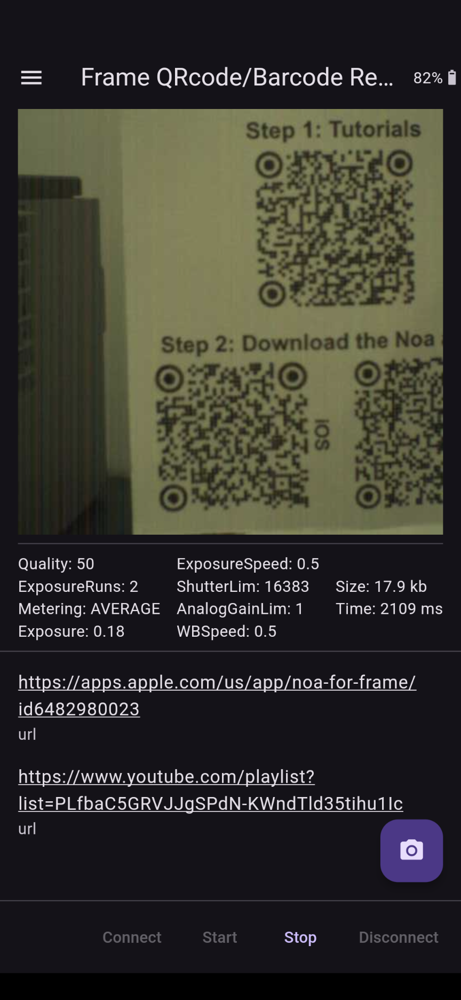
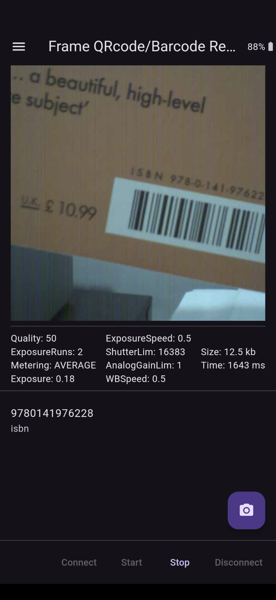

# QR Code / Barcode Reader

Basic QR Code and Barcode reader that takes repeated snapshots and feeds into the [ML Kit QR Code/Barcode detection model](https://developers.google.com/ml-kit/vision/barcode-scanning).

If codes are found, they are shown on the connected Brilliant Labs Frame and displayed in a list in the phone UI. Multiple codes of a range of types can be detected from a single photo. Detected web URLs are clickable in the phone UI and launch in the system default browser.

### Framecast

### Frameshots

### Screenshots

